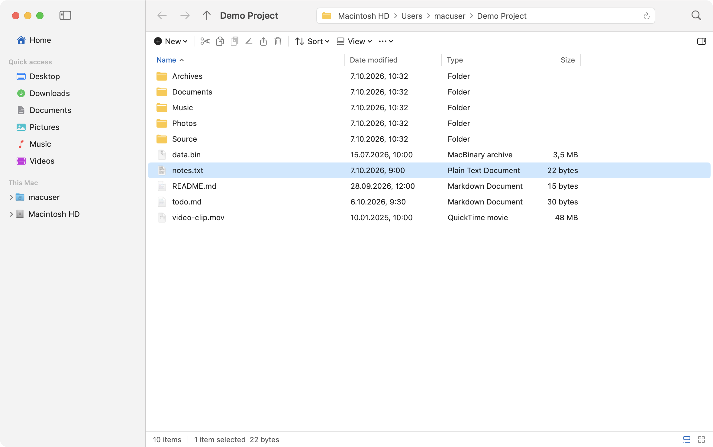
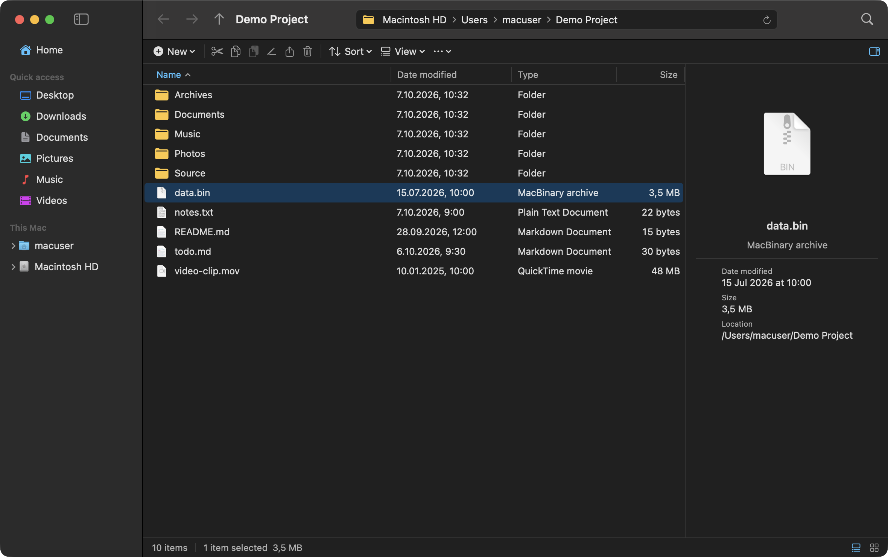
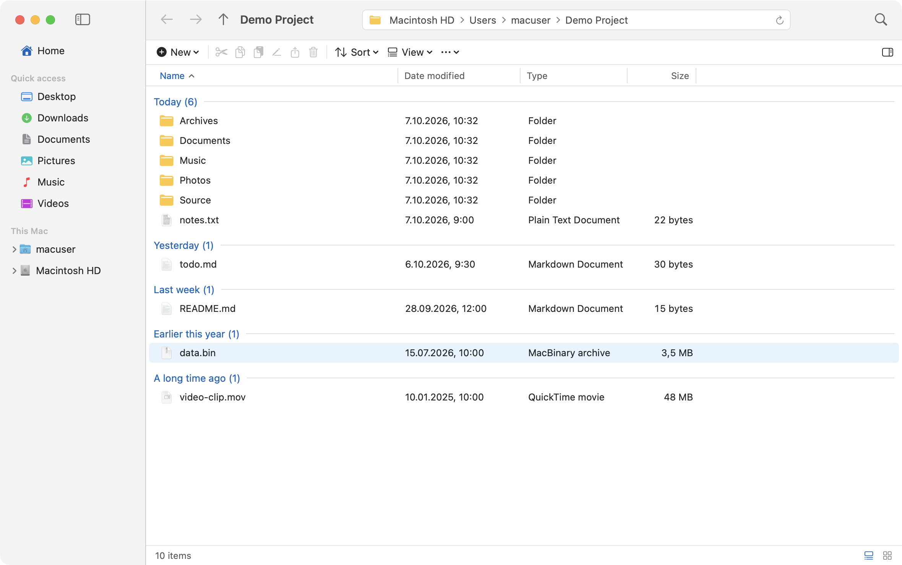
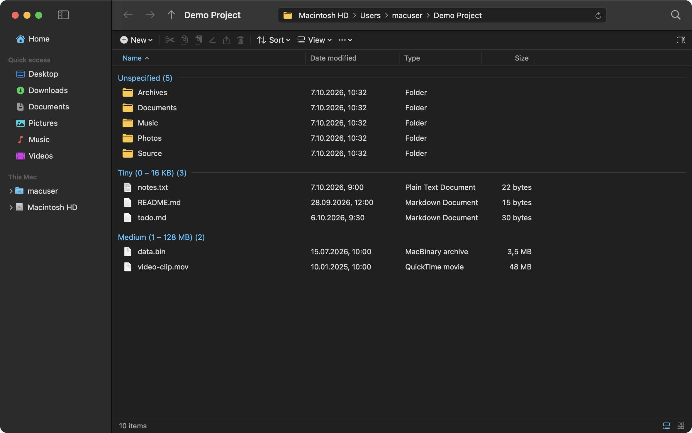
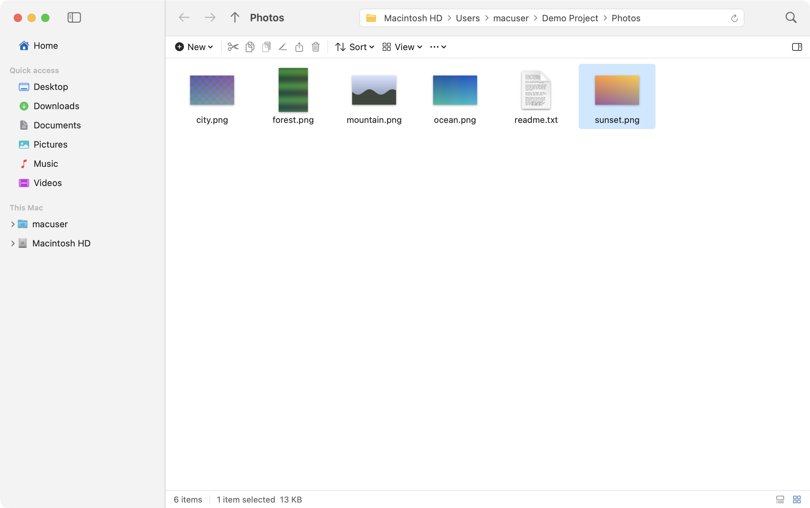
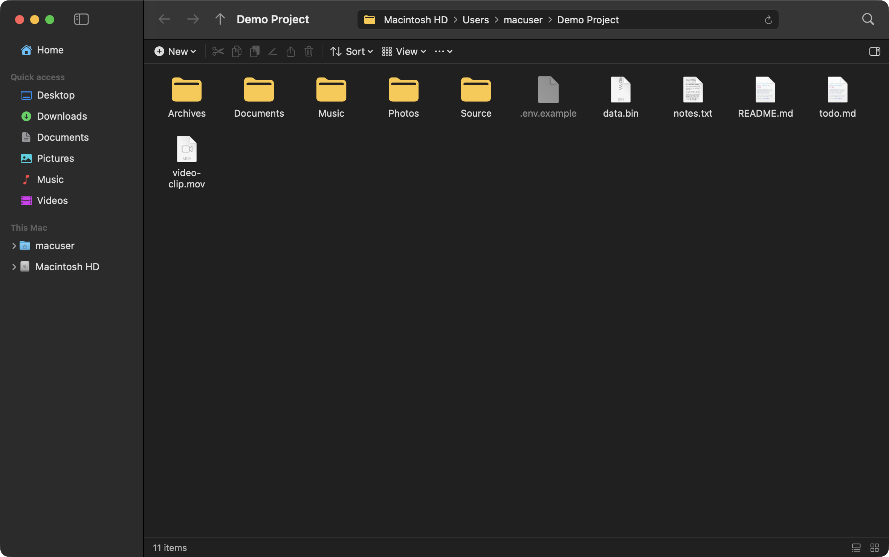
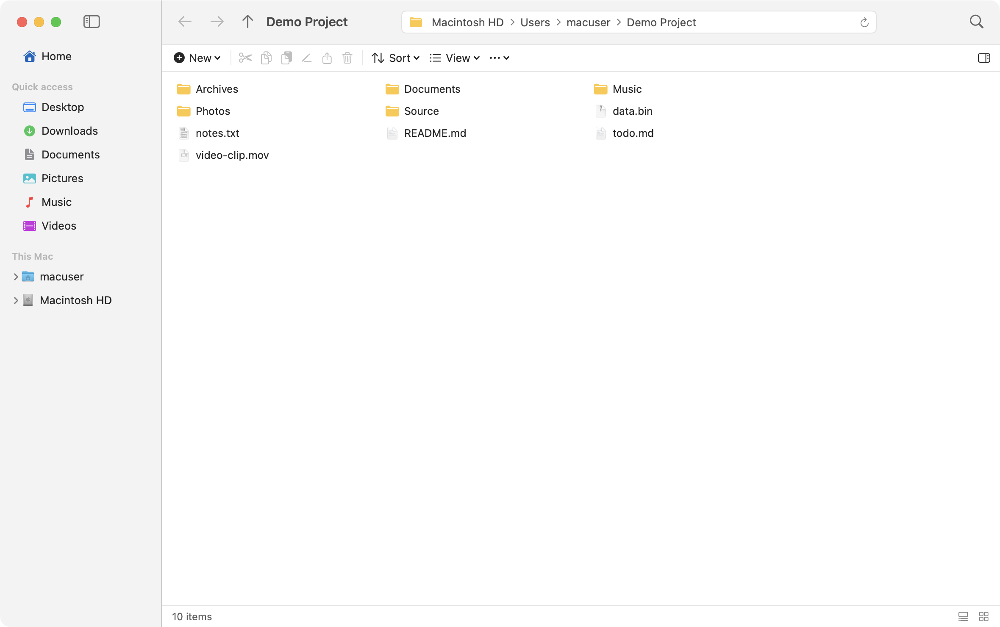
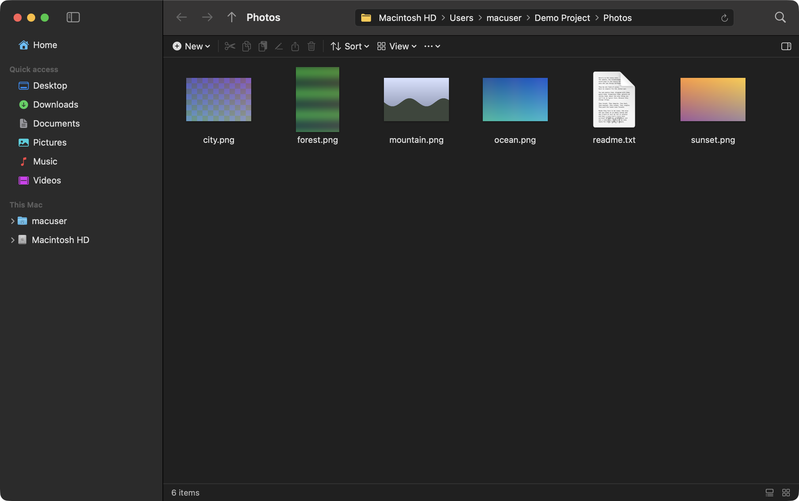

# Explorer for macOS

A native macOS file manager that looks and works like **Windows 11 File Explorer** — built with Swift and SwiftUI/AppKit. Open source, no dependencies.

## Why this exists

Because I'm sick of Apple's file-management nonsense. Finder gets in the way of simple jobs: no real Cut & Paste, a right-click menu that never has what I need, and a layout I never asked for. So I built the file manager I actually want to use — one that gets the job done easy and fast.

If you're a Windows person stuck on a Mac (or just tired of Finder), this is for you.

## Screenshots

| | |
|---|---|
|  |  |
| **Details view** (light) | **Details pane** (dark) |
|  |  |
| **Group by Date modified** | **Group by Size** |
|  |  |
| **Large icons** with image thumbnails | **Medium icons** with hidden items shown |





## Features

> The complete reference — every menu item, view, shortcut and behaviour — is in **[docs/FEATURES.md](docs/FEATURES.md)**.

**Layout**
- Navigation pane: Home, Quick access (pinnable folders) and a folder tree for your disk and volumes
- Address bar with clickable breadcrumbs (⌘L to type a path), Back / Forward / Up, recursive search
- Command bar: New, Cut, Copy, Paste, Rename, Share, Delete, Sort, View
- Details view with resizable, sortable columns; six view modes (Extra large → Small icons, List, Details)
- Group by Name / Date modified / Type / Size, Details pane with thumbnail, status bar
- Real thumbnails for images, videos and PDFs in the icon views
- Windows 11 colours in light and dark mode, inline rename, native macOS tabs (⌘T)

**Right-click menus** (modelled on Windows 11)
- *File / folder:* Cut, Copy, Rename, Share, Delete · Open, Open with, Open in new tab/window, Pin to Quick access, Extract All, Compress to ZIP, Copy as path, Properties
- *Show more options:* Quick Look, Print, Send to, Copy to / Move to folder, Create shortcut, Open in Terminal, Reveal in Finder, Delete permanently, image rotate / set as wallpaper
- *Empty space:* View, Sort by, Group by, Refresh, Undo, Paste, Paste shortcut, Open in Terminal, Select all / Invert selection, New (Folder, Shortcut, Text, RTF, Markdown, HTML, ZIP), Properties

**Behaviour**
- Real **Cut & Paste** (move), "name - Copy" naming on conflicts, multi-level **Undo** (rename, move, copy, delete, create)
- Drag & drop: same volume moves, different volume copies, ⌥ flips
- Live refresh when files change outside the app

## Keyboard shortcuts

| Action | Shortcut |
|---|---|
| Cut / Copy / Paste | ⌘X / ⌘C / ⌘V |
| Rename | F2 |
| Move to Trash / Delete permanently | ⌘⌫ or ⌫ / ⇧⌫ |
| New folder / New window / New tab | ⇧⌘N / ⌘N / ⌘T |
| Back / Forward / Up / Refresh | ⌘[ / ⌘] / ⌘↑ / ⌘R |
| Address bar | ⌘L |
| Properties | ⌥↩ |
| Details pane | ⌥⇧P |
| Hidden items | ⇧⌘. |
| Quick Look | Space |
| Undo | ⌘Z |

## Install

Download `Explorer-<version>-macOS.zip` from the [Releases](../../releases) page, unzip it and drag **Explorer.app** to `/Applications`.

The app is ad-hoc signed but not notarized, so the first time: **right-click → Open** (or run `xattr -dr com.apple.quarantine /Applications/Explorer.app`). Verify the download with the `.sha256` file attached to each release.

## Terminal command: `explorermac`

Open any folder from the terminal:

```bash
explorermac /Users          # open /Users in Explorer (new window if it's already running)
explorermac                 # open the current directory
explorermac ~/Desktop/a.txt # open ~/Desktop with a.txt selected
```

Install it from the app: **Explorer menu → Install ‘explorermac’ Command…** (it copies the script to a writable folder on your PATH — `/usr/local/bin`, `/opt/homebrew/bin` or `~/.local/bin`). From a source checkout you can also run `cp Resources/explorermac /opt/homebrew/bin/`.

## Build from source

Requires macOS 15+ and Xcode (Swift 6 toolchain).

```bash
./build_app.sh            # builds build/Explorer.app (ad-hoc signed)
open build/Explorer.app

swift test                # run the test suite
```

On first launch macOS will ask for access to folders like Documents and Downloads. For full-disk browsing, grant Explorer **Full Disk Access** in System Settings → Privacy & Security.

## Project layout

```
Sources/Explorer/
  App.swift            app entry, windows/tabs, menu-bar commands
  Views.swift          window, navigation pane, address bar, command bar, status bar
  ListViews.swift      Details list, icon/list grids, inline rename, keyboard handling
  ContextMenus.swift   Windows 11-style right-click menus
  ExplorerState.swift  navigation, selection, sorting, grouping, clipboard, undo
  FileActions.swift    compress/extract, shortcuts, New menu, Open with, Share, Send to
  Thumbnails.swift     Quick Look thumbnails for the icon views
  CLIInstaller.swift   installs the `explorermac` terminal command
  Properties.swift     Properties dialog and Details pane
  FileItem.swift       file model, icon cache, folder-tree nodes
  Theme.swift          Windows 11 palette and folder icon
docs/                  FEATURES.md (full reference) and screenshots
Resources/explorermac  the terminal launcher script (bundled into the app)
Tests/ExplorerTests/   unit tests (navigation, file ops, undo, archives, grouping…)
```

## Releases and versioning

Versions follow [Semantic Versioning](https://semver.org/) and are tagged `vMAJOR.MINOR.PATCH`. The current version is in [`VERSION`](VERSION); changes are listed in [CHANGELOG.md](CHANGELOG.md).

To cut a release:

```bash
# 1. bump VERSION, update CHANGELOG.md, commit
./release.sh                                   # tests + builds dist/Explorer-<v>-macOS.zip (+ .sha256)
git tag -a v$(cat VERSION) -m "Explorer $(cat VERSION)"
git push origin main --tags
gh release create v$(cat VERSION) dist/Explorer-$(cat VERSION)-macOS.zip* \
   --title "Explorer $(cat VERSION)" --notes-file RELEASE_NOTES.md
```

## Known limitations

- No Home / Gallery pages, drag-box selection, or Tiles / Content views yet
- Right-clicking an item doesn't highlight it first (the menu still targets it)
- "Restore previous versions" and "Give access to" have no macOS equivalent
- Shortcuts are macOS aliases, not `.lnk` files

## Contributing

Issues and pull requests are welcome. Please run `swift test` before submitting, and add a test for new file-operation behaviour.

## License

[MIT](LICENSE) — free to use, modify and share.

*Not affiliated with or endorsed by Microsoft or Apple. "Windows" and "File Explorer" are trademarks of Microsoft; "macOS" and "Finder" are trademarks of Apple.*
